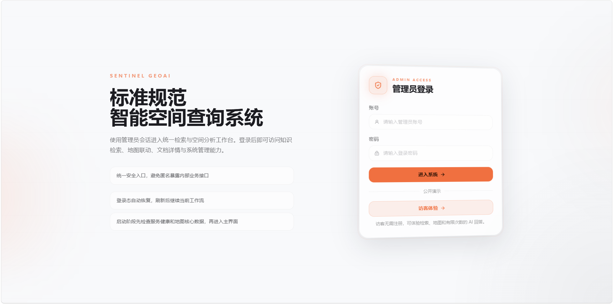
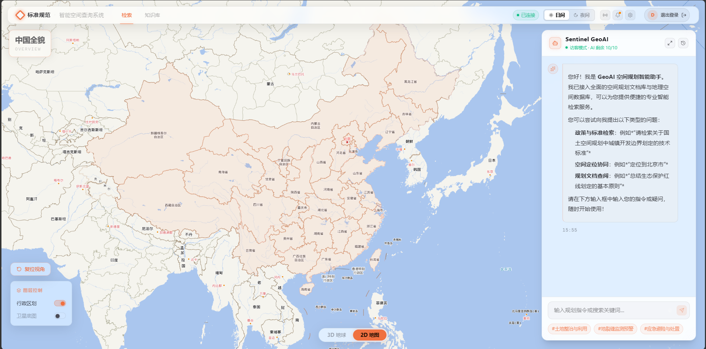
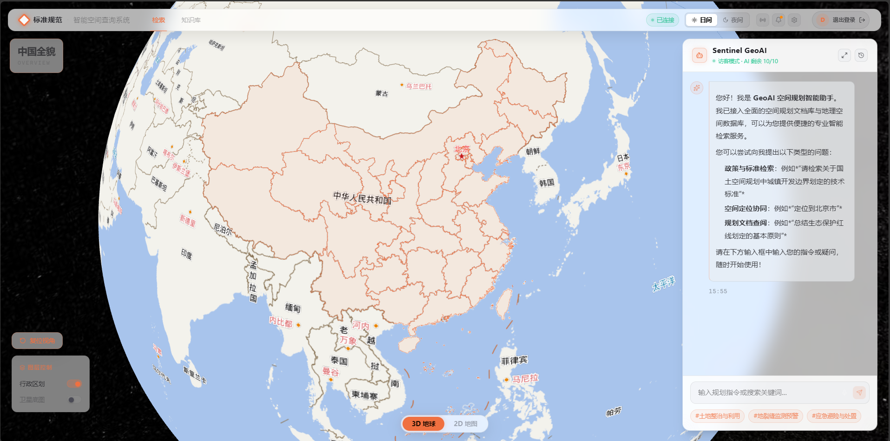

## GeoRAG Planning Assistant / GeoRAG 国土空间规划智能检索与可视化助手

[](https://www.python.org/)
[](https://nodejs.org/)
[](LICENSE)

## 项目简介 / Overview

GeoRAG Planning Assistant 是一个面向国土空间规划、测绘标准与地理信息政策资料的 RAG 智能检索项目。它把标准文档语义检索、引用溯源、有限额度的 AI 问答，以及 2D/3D 地图联动整合到一个可直接演示的工作台中。

GeoRAG Planning Assistant is a retrieval-augmented assistant for spatial planning, surveying standards, and geospatial policy documents. It combines semantic standards search, citation-backed answers, limited AI Q&A, and 2D/3D map interaction in a demo-ready workspace.

## 在线演示 / Live Demo

- 在线地址：[https://8.156.85.7/](https://8.156.85.7/)
- 打开页面后点击  打开页面后点击 `访客体验` 即可进入，无需注册账号。 即可进入，无需注册账号。
- 访客模式支持文档检索、地图浏览、引用查看和有限次数的 AI 回答；AI 额度用完后，仍可继续查看检索结果、引用和地图内容。 访客模式支持文档检索、地图浏览、引用查看和有限次数的 AI 回答；AI 额度用完后，仍可继续查看检索结果、引用和地图内容。


- Demo:  Demo: [https://8.156.85.7/](https://8.156.85.7/)
- Click  Click `访客体验` on the login page to enter without registration. on the login page to enter without registration.
- Visitor mode supports document retrieval, map exploration, citation viewing, and limited AI answers. When the AI quota is used up, retrieval results, citations, and map views remain available. Visitor mode supports document retrieval, map exploration, citation viewing, and limited AI answers. When the AI quota is used up, retrieval results, citations, and map views remain available.

## 产品预览 / Screenshots

登录页提供管理员入口和公开访客体验入口，适合快速进入演示环境。
The login page supports both admin access and public visitor demo entry.



2D 地图工作台把标准检索、AI 问答和行政区划联动放在同一个操作界面中。
The 2D workspace combines standards retrieval, AI Q&A, and administrative map interaction in one interface.



3D 地球视图用于展示更沉浸的空间浏览体验，并保留右侧问答与检索面板。
The 3D globe view provides a more immersive spatial browsing experience while keeping the chat and retrieval panel available.



## 核心能力 / Features

- 标准知识库检索：支持规划、测绘、GIS 标准和政策资料的语义检索与关键词检索。 标准知识库检索：支持规划、测绘、GIS 标准和政策资料的语义检索与关键词检索。
  Standards retrieval: semantic and keyword search over planning, surveying, GIS standards, and policy documents.  Standards retrieval: semantic and keyword search over planning, surveying, GIS standards, and policy documents.
- RAG 问答与引用溯源：AI 回答基于检索结果生成，并保留可查看的文档引用。 RAG 问答与引用溯源：AI 回答基于检索结果生成，并保留可查看的文档引用。
  RAG Q&A with citations: generated answers are grounded in retrieved documents and include traceable references.  RAG Q&A with citations: generated answers are grounded in retrieved documents and include traceable references.
- 访客演示限额：公开演示不开放注册，通过访客会话和每日额度控制 AI 调用成本。 访客演示限额：公开演示不开放注册，通过访客会话和每日额度控制 AI 调用成本。
  Public demo quota: no open registration; visitor sessions and daily quotas limit AI generation cost.  Public demo quota: no open registration; visitor sessions and daily quotas limit AI generation cost.
- 2D/3D 地图联动：使用 OpenLayers 和 Cesium 展示空间数据，并支持地图与检索场景联动。 2D/3D 地图联动：使用 OpenLayers 和 Cesium 展示空间数据，并支持地图与检索场景联动。
  2D/3D map interaction: OpenLayers and Cesium power spatial visualization and search-to-map workflows.  2D/3D map interaction: OpenLayers and Cesium power spatial visualization and search-to-map workflows.
- 管理与展示分离：管理员保留上传、索引和系统管理能力，访客只访问展示和低成本检索能力。 管理与展示分离：管理员保留上传、索引和系统管理能力，访客只访问展示和低成本检索能力。
  Separated admin and demo access: administrators keep upload, indexing, and management tools, while visitors access presentation and low-cost retrieval features.  Separated admin and demo access: administrators keep upload, indexing, and management tools, while visitors access presentation and low-cost retrieval features.

## 技术栈 / Tech Stack

- 后端：FastAPI、SQLAlchemy Async、PostgreSQL、pgvector、PostGIS、MySQL、Redis。 后端：FastAPI、SQLAlchemy Async、PostgreSQL、pgvector、PostGIS、MySQL、Redis。
  Backend: FastAPI, SQLAlchemy Async, PostgreSQL, pgvector, PostGIS, MySQL, and Redis.  Backend: FastAPI, SQLAlchemy Async, PostgreSQL, pgvector, PostGIS, MySQL, and Redis.
- 前端：React 19、TypeScript、Vite、OpenLayers、Cesium、Zustand。 前端：React 19、TypeScript、Vite、OpenLayers、Cesium、Zustand。
  Frontend: React 19, TypeScript, Vite, OpenLayers, Cesium, and Zustand.  Frontend: React 19, TypeScript, Vite, OpenLayers, Cesium, and Zustand.
- 数据服务：PostgreSQL 存储向量与空间数据，MySQL 存储标准元数据，Redis 用于缓存和访客 AI 限额计数。
  Data services: PostgreSQL stores vector and spatial data, MySQL stores standards metadata, and Redis supports caching plus visitor AI quota counters.
- 对象存储：MinIO 作为源文档下载和后续对象存储能力预留，不是主检索链路的必需依赖。
  Object storage: MinIO is reserved for source-document downloads and future object storage flows; it is not required for the main retrieval path.

## 系统架构 / Architecture

项目采用前后端分离结构：FastAPI 提供检索、认证、文档和空间接口，React 工作台负责对话、引用、地图和访客体验入口。

The project uses a separated frontend and backend architecture: FastAPI exposes search, authentication, document, and spatial APIs, while the React workspace handles chat, citations, maps, and visitor demo entry.

```text
geo-rag-planning-assistant/
├─ Backend/                  # FastAPI backend entrypoint: Backend/main.py
│  ├─ main.py
│  └─ app/
├─ frontend/                 # React + Vite frontend
│  ├─ src/
│  └─ package.json
├─ src/geoai/                # Legacy scripts and modules
├─ scripts/                  # Data processing and deployment scripts
├─ docs/                     # Product, deployment, and release docs
└─ docker-compose.yml
```

## 快速开始 / Quick Start

### 后端 / Backend

启动后端前，请在 `Backend/.env` 中配置可用的 PostgreSQL 和 MySQL。PostgreSQL 用于向量和空间检索数据，MySQL 用于标准元数据；任一核心数据库不可用时后端会启动失败。

Before starting the backend, configure usable PostgreSQL and MySQL connections in `Backend/.env`. PostgreSQL is required for vector and spatial retrieval data, and MySQL is required for standards metadata. The backend fails fast if either core database is unavailable.

```bash
cd Backend
python -m venv .venv
.venv\Scripts\activate
pip install -r requirements.txt
copy .env.example .env
uvicorn main:app --reload --host 0.0.0.0 --port 8000
```

### 前端 / Frontend

前端默认请求同源 `/api`。本地开发时 Vite 会把 `/api` 代理到 `http://localhost:8000`；只有跨域或特殊部署时才需要通过 `VITE_API_URL` 覆盖。

The frontend uses same-origin `/api` by default. During local development, Vite proxies `/api` to `http://localhost:8000`; use `VITE_API_URL` only for cross-origin or special deployment scenarios.

```bash
cd frontend
npm install
npm run dev
```

### Docker

如果本地已经准备好所需环境变量，可以使用 Docker Compose 启动完整服务。

If the required environment variables are configured, Docker Compose can start the full service stack.

```bash
docker compose up -d
```

## 文档 / Documentation

- 产品需求：`docs/requirement.md`
  Product requirements: `docs/requirement.md`
- 后端说明：`Backend/README.md`
  Backend guide: `Backend/README.md`
- 前端说明：`frontend/README.md`
  Frontend guide: `frontend/README.md`
- 部署说明：`docs/DEPLOY.md`
  Deployment guide: `docs/DEPLOY.md`
- 发布流程：`docs/RELEASE_WORKFLOW.md`
  Release workflow: `docs/RELEASE_WORKFLOW.md`

## 安全说明 / Security

- 仓库中的示例配置均为占位值，不能直接用于生产环境。
  Example configuration values are placeholders and must not be used in production.
- 真实凭据应通过本地 `.env` 文件或部署平台的密钥管理机制注入。
  Real credentials should be injected through local `.env` files or deployment platform secret management.
- 不要提交真实 API Key、数据库密码或服务器凭据。
  Do not commit real API keys, database passwords, or server credentials.

## License

MIT
