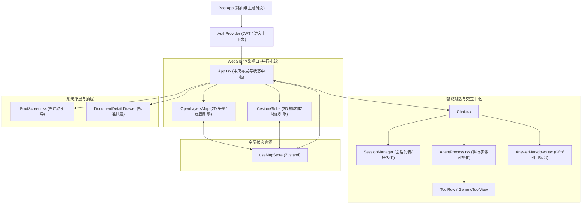

# 阶段三：前端架构与 WebGIS Runtime 深度审查报告

> 审查基线时间：2026-10-09  
> 执行规范依据：[AI 辅助软件工程统一执行规范](../AI_ENGINEERING_STANDARDS.md)  
> 上阶段基线：[阶段二：后端 Agent Runtime 与领域服务深度审查报告](./2026-10-09-stage-2-backend-deep-dive-review.md)

---

## 1. 整体审查进度概览

| 阶段 | 审查主题 | 状态 | 核心交付物 / 目标 |
| :--- | :--- | :--- | :--- |
| **阶段一** | **全局架构与项目认知审查 (System Baseline)** | **已完成 (COMPLETED)** | [`2026-10-09-stage-1-system-baseline-review.md`](./2026-10-09-stage-1-system-baseline-review.md) |
| **阶段二** | **后端 Agent Runtime 与领域服务审查 (Backend Deep-Dive)** | **已完成 (COMPLETED)** | [`2026-10-09-stage-2-backend-deep-dive-review.md`](./2026-10-09-stage-2-backend-deep-dive-review.md) |
| **阶段三** | **前端架构与 WebGIS Runtime 审查 (Frontend Deep-Dive)** | **已完成 (COMPLETED)** | 本文档：React 组件树、Zustand 单一真源、OL/Cesium 双引擎适配、Browser Bridge、App.tsx 膨胀分析 |
| **阶段四** | **跨端契约、协议与安全防御审查 (Contracts & Security)** | **已完成 (COMPLETED)** | [`2026-10-09-stage-4-contracts-and-security-review.md`](./2026-10-09-stage-4-contracts-and-security-review.md) |
| **阶段五** | **工程质量、测试套件与基线验证 (Harness & Evals)** | **已完成 (COMPLETED)** | [`2026-10-09-stage-5-engineering-harness-and-evals-review.md`](./2026-10-09-stage-5-engineering-harness-and-evals-review.md) |
| **阶段六** | **多视角收敛对账与改进路线图 (Convergence & Roadmap)** | **已完成 (COMPLETED)** | [`2026-10-09-stage-6-convergence-and-roadmap-review.md`](./2026-10-09-stage-6-convergence-and-roadmap-review.md) |

---

## 2. React 组件拓扑与状态分发机制

### 2.1 App.tsx 页面级 God Component 深度剖析

- **物理位置**：[`Frontend/src/App.tsx`](file:///d:/work/Project/ragAI%E7%9F%A5%E8%AF%86%E5%BA%93%20(2)/ragAI%E7%9F%A5%E8%AF%86%E5%BA%93/Frontend/src/App.tsx)
- **代码体量**：**1,523 行**，文件大小达 **62.8 KB**。
- **职责超载 (God Component) 表现**：
  - **状态爆炸**：单组件内部维护了 30 余个独立的 React 状态 (`useState`) 与引用句柄 (`useRef`)，涵盖系统引导 (`bootPhase`, `bootStatus`)、用户认证与权限、搜索结果与高亮、对话消息与流式过程、文档预览与右侧抽屉、图层树可见性、2D/3D 视口联动、全局热键以及会话历史。
  - **多层网络与业务编排下沉**：直接在 UI 组件内承载了与 `documentService`、`searchService`、`chatService`、`agentHistory`、`bootstrap` 的异步握手与重试降级逻辑。
  - **内联样式与动画混合**：包含大量 Framer Motion (`motion.section`, `motion.div`) 物理动效配置与玻璃拟态内联 Style。
- **正向工程设计**：
  - 核心外设组件已被合理抽象：对话中枢 [`Chat.tsx`](file:///d:/work/Project/ragAI%E7%9F%A5%E8%AF%86%E5%BA%93%20(2)/ragAI%E7%9F%A5%E8%AF%86%E5%BA%93/Frontend/src/components/Chat.tsx)、三维地球 [`CesiumGlobe.tsx`](file:///d:/work/Project/ragAI%E7%9F%A5%E8%AF%86%E5%BA%93%20(2)/ragAI%E7%9F%A5%E8%AF%86%E5%BA%93/Frontend/src/components/CesiumGlobe.tsx)、二维地图 [`OpenLayersMap.tsx`](file:///d:/work/Project/ragAI%E7%9F%A5%E8%AF%86%E5%BA%93%20(2)/ragAI%E7%9F%A5%E8%AF%86%E5%BA%93/Frontend/src/components/OpenLayersMap.tsx)、系统引导 [`BootScreen.tsx`](file:///d:/work/Project/ragAI%E7%9F%A5%E8%AF%86%E5%BA%93%20(2)/ragAI%E7%9F%A5%E8%AF%86%E5%BA%93/Frontend/src/components/BootScreen.tsx) 均独立封装。
- **重构建议 (P1)**：
  - 将 `App.tsx` 拆分为：
    1. `useAppBootstrap`：处理健康检查与天地图/省份 GeoJSON 引导缓存；
    2. `useDocumentDrawer`：控制右侧文档详情滑出与元数据渲染；
    3. `useGlobalHotkeys`：收敛全局快捷键监听；
    4. `MapViewportShell`：专门管理双引擎地图容器与视口遮罩。

### 2.2 前端组件拓扑结构



### 2.3 AgentProcess 与事件投影架构 (Event Projector)

- **物理位置**：
  - [`Frontend/src/components/agent/eventProjector.ts`](file:///d:/work/Project/ragAI%E7%9F%A5%E8%AF%86%E5%BA%93%20(2)/ragAI%E7%9F%A5%E8%AF%86%E5%BA%93/Frontend/src/components/agent/eventProjector.ts)
  - [`Frontend/src/components/agent/AgentProcess.tsx`](file:///d:/work/Project/ragAI%E7%9F%A5%E8%AF%86%E5%BA%93%20(2)/ragAI%E7%9F%A5%E8%AF%86%E5%BA%93/Frontend/src/components/agent/AgentProcess.tsx)
- **架构亮点**：
  - **纯 TypeScript 领域模型解耦**：前端未直接将网络层 SSE 原始 JSON 绑定到 React 渲染树，而是构建了领域投影器 [`AgentEventProjector`](file:///d:/work/Project/ragAI%E7%9F%A5%E8%AF%86%E5%BA%93%20(2)/ragAI%E7%9F%A5%E8%AF%86%E5%BA%93/Frontend/src/components/agent/eventProjector.ts#L16)。
  - **幂等性与乱序容忍**：
    - 使用 `seenEvents` (`Set<string>`) 基于 `event_id` 或 `seq` 拦截重复投递。
    - 使用 `WeakMap` 与稳定排序算法处理事件时序 (`sequence`) 重排。
  - **状态机闭环**：
    - 准确识别 `controller_decision`、`tool_started`、`tool_completed`、`browser_tool_requested`、`browser_tool_completed`。
    - 特别针对浏览器端交互，状态自动流转为 `waiting_browser`（标记执行场域为 `browser`），在终端回执到达前阻止错误的状态终结。

---

## 3. Zustand 全局状态中枢与单一真源机制

### 3.1 空间状态中枢设计原则

- **物理位置**：[`Frontend/src/store/useMapStore.ts`](file:///d:/work/Project/ragAI%E7%9F%A5%E8%AF%86%E5%BA%93%20(2)/ragAI%E7%9F%A5%E8%AF%86%E5%BA%93/Frontend/src/store/useMapStore.ts)
- **状态规格**：
  - `activeRegion: { adcode: string; name: string } | null`：当前选中的行政区划。
  - `viewState: { center: [number, number]; zoom: number; height: number }`：统一视角参数（EPSG:4326 经纬度、2D 层级与 3D 高度）。
  - `viewMode: '2D' | '3D'`：当前活动地图引擎。
  - `flyTrigger: number`：递增计数器，作为跨引擎飞行动画同步信号。
- **单一真源约束**：
  - 架构严格规定：所有省份点击、Agent 定位指令或视角重置，**必须首先写入 `useMapStore`**，再由各个引擎组件订阅并触发镜头平滑过渡，坚决杜绝组件内维护局部孤立状态（杜绝“自嗨”）。

### 3.2 2D/3D 视角无缝转换数学引擎

两套引擎投影与相机模型天然异构：
- **OpenLayers**：基于 WebMercator (EPSG:3857) 投影，赤道标准分辨率常数：
  $$R_0 = \frac{2 \pi \times 6378137}{256} \approx 156543.03392804097$$
  在特定纬度 $\phi$ 下的地表物理分辨率为：
  $$\text{res}(\phi, z) = \frac{R_0}{2^z} \cdot \cos(\phi)$$
  屏幕视口高度 $H_{\text{viewport}}$ 对应的地表垂直跨度为：
  $$S_v = H_{\text{viewport}} \cdot \text{res}(\phi, z)$$
- **Cesium**：基于透视视锥体 (Perspective Frustum) 相机模型。其视锥体垂直半视场角正切值 $\tan\left(\frac{\text{fovy}}{2}\right)$ 在宽屏模式下会根据宽高比进行修正：
  $$\text{相机高度 } h = \frac{S_v / 2}{\tan\left(\frac{\text{fovy}}{2}\right)}$$

代码中实现了精准的双向解析方程：
```typescript
// OL Zoom -> Cesium Height
export const zoomToHeight = (zoom: number, lat: number = 33.0): number => {
  const { w, h } = getViewportSize();
  const resAtEquator = R0 / Math.pow(2, zoom);
  const trueRes = resAtEquator * Math.cos(lat * Math.PI / 180);
  const visibleVerticalMeters = h * trueRes;
  const tanHalfFovy = getTanHalfFovy(w, h);
  return (visibleVerticalMeters / 2) / tanHalfFovy;
};

// Cesium Height -> OL Zoom
export const heightToZoom = (height: number, lat: number = 33.0): number => {
  const { w, h } = getViewportSize();
  const tanHalfFovy = getTanHalfFovy(w, h);
  const visibleVerticalMeters = 2 * Math.max(height, 1) * tanHalfFovy;
  const trueRes = visibleVerticalMeters / h;
  const resAtEquator = trueRes / Math.cos(lat * Math.PI / 180);
  return Math.log2(R0 / resAtEquator);
};
```
该数学模型保证了用户在任意缩放层级与视口尺寸下切换 2D/3D 模式时，地表覆盖范围均能实现视觉无缝平滑衔接。

---

## 4. WebGIS 双引擎适配与生命周期管理

### 4.1 并行常驻挂载策略与 WebGL 上下文保活

- **渲染机制**：
  在 [`App.tsx`](file:///d:/work/Project/ragAI%E7%9F%A5%E8%AF%86%E5%BA%93%20(2)/ragAI%E7%9F%A5%E8%AF%86%E5%BA%93/Frontend/src/App.tsx#L1050-L1068) 中，`CesiumGlobe` 与 `OpenLayersMap` **同时挂载于 DOM**，并通过 CSS 类名 `visible ? 'block' : 'hidden'` 控制可见性。
- **架构决策依据**：
  - *优点*：Cesium 初始化需创建完整的 WebGL 3D 渲染上下文、加载椭球地形、编译多组着色器并预热瓦片缓存。若采用条件渲染 (`{viewMode === '3D' && <CesiumGlobe />}`)，每次切换将造成数秒的卡顿、黑屏与网络重复请求。
  - *成本*：常驻两个 WebGL 上下文会消耗大约 150MB~300MB 显存。
- **性能补偿设计**：
  在隐藏状态下通过 CSS `pointer-events: none` 阻断用户事件捕获。

### 4.2 Cesium 渲染性能深度调优

针对 Cesium 常见的性能与内存隐患，[`CesiumGlobe.tsx`](file:///d:/work/Project/ragAI%E7%9F%A5%E8%AF%86%E5%BA%93%20(2)/ragAI%E7%9F%A5%E8%AF%86%E5%BA%93/Frontend/src/components/CesiumGlobe.tsx) 实施了针对性优化：
1. **显式启用按需渲染 (`requestRenderMode = true`)**：
   禁止无意义的每秒 60 帧无脑重绘，仅在相机移动、要素悬浮高亮或数据加载完成时调用 `scene.requestRender()`。
2. **剔除性能杀手 `clampToGround` 折线**：
   地面贴合多边形折线计算极其消耗 GPU 几何着色器资源；采用纯贴地 Polygon 填充并在点击时才动态生成加粗高亮线。
3. **MOUSE_MOVE 事件节流**：
   鼠标滑过地图时的场景拾取 (`scene.pick`) 操作进行了帧率节流，杜绝主线程卡顿。
4. **底图双载与低透明度保活**：
   天地图矢量底图与卫星影像底图在初始化时全部挂载，非激活底图赋予 `alpha = 0.01` 保活，切换底图时仅做透明度过渡，避免重新发起切片请求导致“闪白屏”。

### 4.3 引擎销毁与内存防泄漏机制

在组件卸载阶段（如路由跳转到登录页），必须显式回收 WebGL 与底层事件监听器：
- **OpenLayers**：清理图层源并解绑 Map 实例与 DOM 容器绑定。
- **Cesium**：
  ```typescript
  return () => {
    unregisterGisRuntime();
    if (eventHandlerRef.current) {
      if ((eventHandlerRef.current as any)._cleanupPointerLeave) {
        (eventHandlerRef.current as any)._cleanupPointerLeave();
      }
      eventHandlerRef.current.destroy();
      eventHandlerRef.current = null;
    }
    if (viewerRef.current) {
      viewerRef.current.destroy();
      viewerRef.current = null;
    }
    entitiesRef.current = [];
    entityByAdcodeRef.current.clear();
  };
  ```
  严格执行 `viewer.destroy()`，释放 Cesium 全局资源，避免多页面进出导致的 WebGL 上下文泄露崩溃 (`CONTEXT_LOST_WEBGL`)。

---

## 5. Browser Bridge 执行器与 Agent 闭环通讯

### 5.1 跨端指令分发机制

- **物理位置**：
  - [`Frontend/src/gis/browserBridge.ts`](file:///d:/work/Project/ragAI%E7%9F%A5%E8%AF%86%E5%BA%93%20(2)/ragAI%E7%9F%A5%E8%AF%86%E5%BA%93/Frontend/src/gis/browserBridge.ts)
  - [`Frontend/src/gis/frontendExecutor.ts`](file:///d:/work/Project/ragAI%E7%9F%A5%E8%AF%86%E5%BA%93%20(2)/ragAI%E7%9F%A5%E8%AF%86%E5%BA%93/Frontend/src/gis/frontendExecutor.ts)
  - [`Frontend/src/gis/cesiumRuntime.ts`](file:///d:/work/Project/ragAI%E7%9F%A5%E8%AF%86%E5%BA%93%20(2)/ragAI%E7%9F%A5%E8%AF%86%E5%BA%93/Frontend/src/gis/cesiumRuntime.ts)
- **架构设计**：
  ```mermaid
  sequenceDiagram
      autonumber
      participant Server as 后端 Agent Runtime
      participant CS as 前端 ChatService (Stream)
      participant Bridge as BrowserBridge
      participant Exe as FrontendExecutor / CesiumRuntime
      participant Map as OL / Cesium 地图引擎

      Server->>CS: SSE 推送: publication_state = tool_execution_required<br/>(含 trace_id, pending_tool_call_id, map_action)
      CS->>Bridge: executeBrowserTool(trace_id, tool_call_id, map_action)
      Bridge->>Exe: execute(runId, toolCallId, action)
      Exe->>Map: 执行地图动作 (fit / select / import / locate)
      Map-->>Exe: 完成渲染与视口变化
      Exe->>Bridge: 返回操作结果
      Bridge->>Bridge: 捕获最新 BrowserMapContext (快照 & revision++)
      Bridge-->>CS: 返回 BrowserToolReceipt
      CS->>Server: 发起续接请求 (带 continuation_token & receipt)
  ```

### 5.2 状态快照与版本演进 (BrowserMapContext)

- 依据协议标准 [`Frontend/src/gis/contracts.ts`](file:///d:/work/Project/ragAI%E7%9F%A5%E8%AF%86%E5%BA%93%20(2)/ragAI%E7%9F%A5%E8%AF%86%E5%BA%93/Frontend/src/gis/contracts.ts)，快照包含：
  - `schema_version: 2`；
  - `dimension: '2d' | '3d'`；
  - `ready: boolean`；
  - `supported_tools: string[]`（根据当前地图状态动态计算）；
  - `viewport`: `{ center, zoom, crs: 'EPSG:4326' }`；
  - `active_region`: 当前选中的行政区划；
  - `layer_tree`: 图层树节点数组（包含图层名、可见性、透明度）；
  - `user_layers`: 客户端导入的用户矢量图层数组；
  - `available_files`: 浏览器内存中注册的待导入文件列表。
- **版本哈希增量**：
  通过比较快照 JSON 序列化字符串签名，一旦图层、视口或要素发生改变，`revision` 单调自增，向后端保证地图状态的可观测性与时序单调性。

### 5.3 幂等性控制与防并发队列

在 [`frontendExecutor.ts`](file:///d:/work/Project/ragAI%E7%9F%A5%E8%AF%86%E5%BA%93%20(2)/ragAI%E7%9F%A5%E8%AF%86%E5%BA%93/Frontend/src/gis/frontendExecutor.ts#L29-L42) 中：
1. **调用签名缓存**：
   基于 `${runId}:${toolCallId}` 建立 Map 缓存。若收到相同 ID 且载荷一致的请求，直接复用既有 Promise；若载荷冲突，抛出 `TOOL_CALL_CONFLICT` 错误。
2. **Promise 串行执行队列**：
   通过 `queue = queue.then(...)` 强制客户端地图动画与图层操作按次序串行推进，避免并发 `fit` 或 `animate` 产生渲染碰撞冲突。
3. **执行时限安全网**：
   在 [`browserBridge.ts`](file:///d:/work/Project/ragAI%E7%9F%A5%E8%AF%86%E5%BA%93%20(2)/ragAI%E7%9F%A5%E8%AF%86%E5%BA%93/Frontend/src/gis/browserBridge.ts#L28-L53) 中使用 `Promise.race` 包装 `timeout_seconds`，超时后安全熔断并生成 `status: 'failed'` 的回执，防止前端死挂阻塞 Agent 全局轮次。

### 5.4 客户端流式续接回路与安全限次

- **物理位置**：[`Frontend/src/services/chatService.ts`](file:///d:/work/Project/ragAI%E7%9F%A5%E8%AF%86%E5%BA%93%20(2)/ragAI%E7%9F%A5%E8%AF%86%E5%BA%93/Frontend/src/services/chatService.ts#L330-L415)
- **多轮交互回路**：
  客户端在发起 SSE 请求后，若后端返回工具请求，前端在本地执行后生成 `BrowserToolReceipt`，携带 `continuation_token` 在**同一个会话流中继续向 `/api/search/query/stream` 发起续接请求**。
- **客户端死循环安全断路器**：
  硬编码了最大循环保护：`for (let browserStep = 0; browserStep <= 8; browserStep += 1)`。如果 Agent 连续调度超过 8 次浏览器地图动作未结束，前端强制阻断并抛出 `BrowserContinuationError('Browser GIS continuation exceeded the client safety limit.')`，有效防御模型发散带来的死循环网络风暴。

---

## 6. 引擎能力不对称与核心技术债识别

### 6.1 2D 与 3D 工具能力割裂异味 (Architectural Asymmetry)

审查中发现了严重的引擎能力不对称现象：

| 工具名称 | OpenLayers (2D) 支持度 | Cesium (3D) 支持度 | 不一致影响评估 |
| :--- | :---: | :---: | :--- |
| `locate_map` |  支持 (平滑平移缩放) |  支持 (Camera flyTo) | 体验一致 |
| `select_region` |  支持 (双层发光高亮) |  支持 (材质与边界线高亮) | 体验一致 |
| `set_layer_visibility` |  支持 (递归图层树查找) |  支持 (受限内置 3 个图层) | 3D 图层范围受限 |
| `import_vector_dataset` |  支持 (Shapefile/GeoJSON) | ❌ **不支持** (`UNSUPPORTED_TOOL`) | **严重**：3D 模式下无法导入数据 |
| `render_geojson_layer` |  支持 (即时几何着色) | ❌ **不支持** (`UNSUPPORTED_TOOL`) | **严重**：3D 模式下无法展示空间分析结果 |
| `set_vector_style` |  支持 (动态边框/填充修改) | ❌ **不支持** (`UNSUPPORTED_TOOL`) | **中等**：3D 模式无法调色 |
| `fit_vector_layer` |  支持 (根据要素包围盒缩放) | ❌ **不支持** (`UNSUPPORTED_TOOL`) | **中等**：3D 模式无法聚焦要素 |
| `inspect_layer_features` |  支持 (分页查看属性表) | ❌ **不支持** (`UNSUPPORTED_TOOL`) | **中等**：3D 模式无法审查属性 |
| `get_feature_geometry` |  支持 (导出 RFC 7946 GeoJSON) | ❌ **不支持** (`UNSUPPORTED_TOOL`) | **中等**：3D 模式无法下钻几何 |

- **技术债定级**：**P1 (架构不对称债务)**
- **系统风险**：
  在 Cesium 3D 模式下，[`cesiumRuntime.ts`](file:///d:/work/Project/ragAI%E7%9F%A5%E8%AF%86%E5%BA%93%20(2)/ragAI%E7%9F%A5%E8%AF%86%E5%BA%93/Frontend/src/gis/cesiumRuntime.ts#L66-L67) 上报的快照中 `user_layers: []` 恒为空，且仅上报 2~3 个基础工具。若用户向 Agent 提出“导入某土地红线数据并在地图上渲染”，在 3D 模式下 Agent 将因找不到工具或执行失败而报错。必须在后续版本中基于 Cesium `GeoJsonDataSource` 补齐 3D 矢量图层渲染与样式修改能力。

### 6.2 客户端内存态矢量文件存储的技术隐患

- **物理位置**：[`Frontend/src/gis/fileReferenceStore.ts`](file:///d:/work/Project/ragAI%E7%9F%A5%E8%AF%86%E5%BA%93%20(2)/ragAI%E7%9F%A5%E8%AF%86%E5%BA%93/Frontend/src/gis/fileReferenceStore.ts)
- **实现机制**：
  采用 JavaScript 原生 `Map<string, DatasetRecord>` 存放用户上传的 Shapefile、GeoJSON 和解压后的内存文件，分配 `vf_${crypto.randomUUID()}` 文件句柄。
- **潜在隐患**：
  1. **易失性**：由于完全保存在页面内存中，一旦用户 F5 刷新页面，所有 `vf_` 句柄立即失效，对话历史中引用的文件无法再次加载。
  2. **主线程阻塞风险**：解压大型 ZIP 及解析大体积 Shapefile（基于 `shapefile` NPM 包）均在前端主线程同步执行，可能导致浏览器 UI 冻结（缺少 Web Worker 离屏解析机制）。

### 6.3 契约严密性评估与类型安全

- **物理位置**：[`Frontend/src/lib/api/contractClient.ts`](file:///d:/work/Project/ragAI%E7%9F%A5%E8%AF%86%E5%BA%93%20(2)/ragAI%E7%9F%A5%E8%AF%86%E5%BA%93/Frontend/src/lib/api/contractClient.ts)
- **评估结论**：**极高水准**。
  前端使用 `openapi-typescript` 从后端 OpenAPI 文档自动生成 [`schema.d.ts`](file:///d:/work/Project/ragAI%E7%9F%A5%E8%AF%86%E5%BA%93%20(2)/ragAI%E7%9F%A5%E8%AF%86%E5%BA%93/Frontend/src/lib/api/generated/schema.d.ts)。`contractClient.ts` 基于泛型条件类型（Conditional Types）实现了：
  - 路径合法性强校验（非法路由直接引发编译报错）；
  - 请求方法、路径参数、Query 参数、JSON Body 的双向强类型约束；
  - 响应结果根据 HTTP 状态码（200 / 201 / 204）精准推导。
  配合工程脚本 `npm run contract:check`，严禁在前端随意手写非契约 API 调用。

---

## 7. 自动化验证与测试基线结果

审查过程中对前端全部自动化测试套件与类型规范进行了实际验证：

### 7.1 Vitest 单元测试运行结果

执行命令：`npm run test:unit`

```text
 RUN  v3.2.4 D:/work/Project/ragAI知识库 (2)/ragAI知识库/frontend

 ✓ tests/authorityContract.test.ts (1 test) 5ms
 ✓ tests/browserBridgeActiveRuntime.test.ts (5 tests) 19ms
 ✓ tests/agentEventProjector.test.ts (13 tests) 9ms
 ✓ tests/geoaiHarness.test.ts (3 tests) 7ms
 ✓ tests/cesiumRuntime.test.ts (3 tests) 6ms
 ✓ tests/selectRegionRuntime.test.ts (2 tests) 3ms
 ✓ tests/agentProcessUi.test.tsx (7 tests) 44ms
 ✓ tests/agentStreamProcess.test.ts (3 tests) 5ms
 ✓ tests/agentHistory.test.ts (11 tests) 10ms
 ✓ tests/gisObservationContract.test.ts (3 tests) 9ms
 ✓ tests/answerMarkdown.test.tsx (8 tests) 209ms
 ✓ tests/chatServiceMapContext.test.ts (4 tests) 32ms

 Test Files  12 passed (12)
      Tests  63 passed (63)
```

**测试结论**：全部 **12 个测试套件，63 个单元测试用例 100% 通过**。涵盖了浏览器桥接运行时切换、Agent 事件投影器、会话历史恢复、Markdown 渲染、GIS 观测契约与权限边界。

### 7.2 动效与视口验证脚本

执行结果：
- `bootScreenMotion.test.ts`：**Passed**（验证引导屏幕动效参数一致性）
- `documentDetailTheme.test.ts`：**Passed**（验证文档抽屉主题变量）
- `loginMotion.test.ts`：**Passed**（验证登录过渡物理动效）
- `mapViewport.test.ts`：**Passed**（验证分屏、全屏视口尺寸与边距计算）

### 7.3 代码规范与类型检查 (Lint & TypeCheck)

执行命令：`npm run lint`

```text
Text encoding check passed (374 files scanned).
API contract usage check passed.
tsc --noEmit (TypeScript v5.8.2) passed with 0 errors.
```

**结论**：前端工程无任何文本编码异常、无违规绕过契约客户端的 API 调用，TypeScript 全量静态类型检查 0 错误。

---

## 8. 阶段三审查核心结论与阶段四行动建议

### 8.1 阶段三关键结论

1. **架构设计前瞻性高**：Zustand 单一真源与数学视角换算引擎极为出色，彻底解决了 2D 与 3D 双引擎切换时的跳动与失步痛点。
2. **事件投影与流式架构健全**：前端基于纯 TypeScript 投影器将 SSE 流转化为响应式 ViewModel，与 React 渲染解耦彻底，容错与幂等机制完备。
3. **App.tsx 膨胀构成主要维护瓶颈**：1,523 行的单体超大组件承担了过多跨域职责，是后续 UI 迭代与多人协作的高风险点。
4. **双引擎能力不对称是核心功能盲区**：3D 模式缺失矢量数据渲染与样式控制工具，若用户在 3D 视角下触发空间分析，Agent 闭环将受阻。

### 8.2 阶段四审查行动建议

下一阶段将进入**阶段四：跨端契约、协议与安全防御审查**，重点关注：
1. **SSE 事件流传输协议安全性**：检查 SSE 协议断线重连、背压缓冲与消息边界截断防护；
2. **MapContext 准入防注入与沙箱隔离**：后端在接收前端提交的 `map_context` 时是否存在信任盲区，防御恶意的 GeoJSON 坐标与超长图层树注入；
3. **Browser Tool Receipt 闭环对账**：验证 `continuation_token` 与 CAS 令牌时效性，杜绝伪造前端执行回执；
4. **多租户与鉴权边界**：验证 `/api/search/query`、`/api/agent/browser-action/resume` 等核心端点在访客与管理员上下文下的隔离机制。
